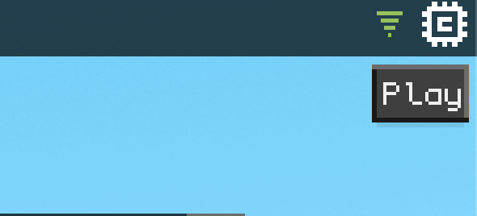
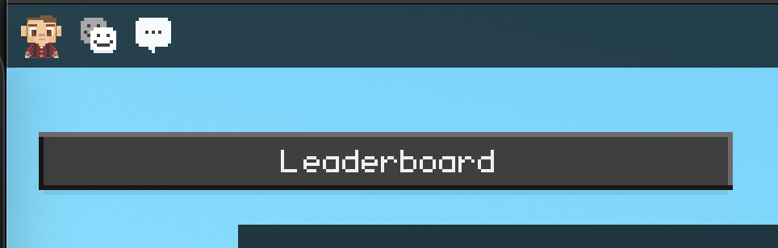
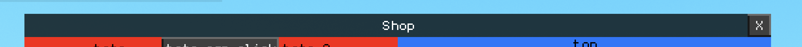
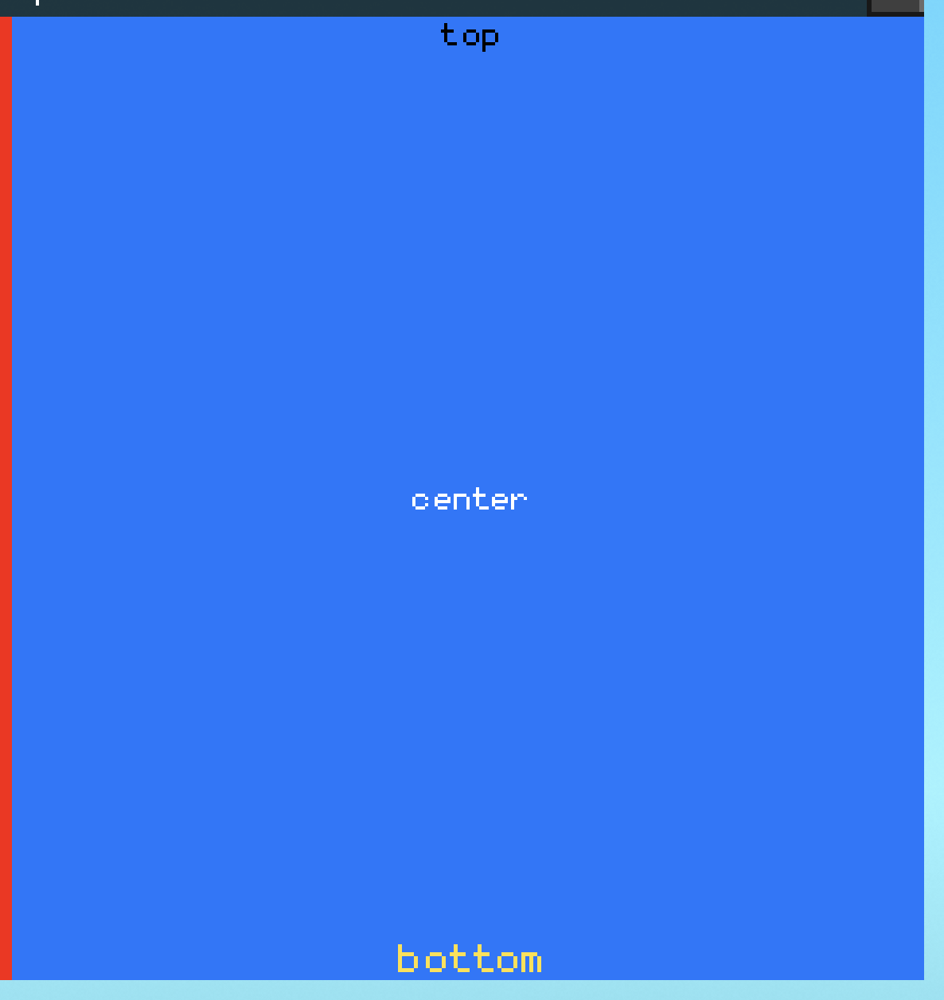
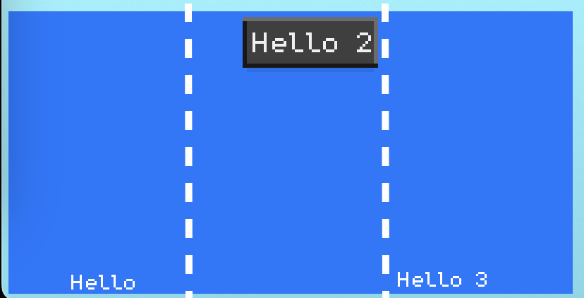
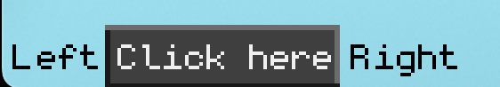

# UI Blocks

UI Blocks is a module that allows you to place UI Kit nodes without having to set the position in parentDidResize. The goal is to avoid setting the position of each element in parentDidResize and instead use blocks with different settings (triptych, columns, rows or containers) so that your UI is responsive to the screen size (desktop or mobile).

## Usage

### Import

```lua
Modules = {
	ui_blocks = "github.com/caillef/cubzh-library/ui_blocks:873c6f1"
}
```

### Node Anchors

Easiest way to place your ui node in a specific corner or in the center.

#### anchorNode

Set the position of a node based on its parent.

Parameters:
1) ui node: the UI node
2) horizontal align: can be "left"/"center"/"right" (if nil, center by default)
3) vertical align: can be "bottom"/"center"/"top" (if nil, center by default)
4) margin: a single number or { marginLeft, marginBottom, marginRight, marginTop }

⚠️ This function only works if you do not define parentDidResize. Check `setNodePos` for more information.

```lua
local playBtn = ui:createButton("Play")
ui_blocks:anchorNode(playBtn, "right", "top", 5)
```



#### setNodePos

If we need to define parentDidResize, we can't use the `anchorNode` function. For example here, we need to resize the button based on the Screen Width, so we use setNodePos. The parameters are the same as anchorNode.

```lua
local leaderboardBtn = ui:createButton("Leaderboard")
leaderboardBtn.parentDidResize = function()
    leaderboardBtn.Width = Screen.Width * 0.3
    ui_blocks:setNodePos(leaderboardBtn, "left", "top", { 0, 0, 20, 40 }) -- 20 margin left, 40 margin top
end
leaderboardBtn:parentDidResize()
```



### createBlock

This function can create 3 types of blocks:

1) Triptych: if horizontal, you can set node for left/center/right. if vertical, you can set node for top/center/bottom.
2) Columns: they all have the same size
3) Rows: they all have the same size

You can't use more than one type when calling createBlock (you can't define columns and triptych for example)

In the config of a block, you can have up to 4 properties + 1 type:
```lua
local topBar = ui_blocks:createBlock({
    -- if width or height are not defined, take the full width and height of the parent
    width = function(node, elems) return 200 end,
    height = function(node, elems) return node.parent.Height end,
    pos = function(node) return { 10, 20 } end,
    parentDidResize = function(node)
        -- here you can do actions on the block when the parent is resized (no need to handle pos or size of the block)
    end

    -- then you define either triptych, columns or rows.
```

⚠️ do not redefined parentDidResize on a block, it will break the responsiveness of the block.

#### Triptych

Triptych is the best way to anchor elements on the left/center/right of an horizontal triptych or top/center/bottom of a vertical triptych.

You need to define the horizontal or vertical using `dir` for direction.

Example of an horizontal triptych for a topbar
```lua
local closeBtn = ui:createButton("X")
closeBtn.onRelease = function()
    print("close")
end

local topBar = ui_blocks:createBlock({
    -- width is full width, height is closeBtn.Height
    height = function() return closeBtn.Height end,
    triptych = {
        dir = "horizontal",
        color = Color(0,0,0,0.5), -- black with 50% opacity
        center = ui:createText("Shop", Color.White),
        right = closeBtn
    },
    -- called once all the objects are created, you can access elems[key]
    parentDidResize = function(node)
        -- here we adjust the width so that the button is a square
        closeBtn.Width = closeBtn.Height
    end,
})
```



Example of a vertical triptych
```lua
local rightPanel = ui_blocks:createBlock({
    triptych = {
        dir = "vertical",
        color = Color.Blue, -- background color
        top = ui:createText("top"),
        center = ui:createText("center"),
        bottom = ui:createText("bottom"),
    },
})
```



```lua
local leftPanel = ui:createFrame(Color.Blue)

local container = ui_blocks:createBlock({
    height = function(node) return node.parent and node.parent.Height - topBar.Height or 0 end,
    columns = { leftPanel, rightPanel },
})

-- window is a vertical triptych with the topbar and the bottom (height of bottom is computed above)
local window = ui_blocks:createBlock({
    width = function() return Screen.Width * 0.8 end,
    height = function() return Screen.Height * 0.7 end,
    pos = function() return { Screen.Width * 0.5 - node.Width * 0.5, Screen.Height * 0.5 - node.Height * 0.5 } end,
    triptych = {
        dir = "vertical",
        color = Color(0,0,0,0.5),
        top = topBar,
        bottom = container,
    },
})
window:parentDidResize()
```

#### Columns and Rows

Columns and Rows will divide equally the space based on the size of the parent node.

```lua
local classicText = ui:createText("Hello", Color.White, "small")
ui_blocks:anchorNode(classicText, "center", "bottom")

local buttonHello2 = ui:createButton("Hello 2")
ui_blocks:anchorNode(buttonHello2, "right", "top", 4)

local classicText3 = ui:createText("Hello 3", Color.White, "small")
ui_blocks:anchorNode(classicText3, "left", "bottom", { 0, 2, 10, 0 })

local columns = ui_blocks:createBlock({
    -- to make rows, replace this with "rows"
    columns = {
        -- you can push as many elements as you want here as columns
        classicText,
        buttonHello2,
        classicText3,
    }
})

local frame = ui:createFrame(Color.Blue)
frame.parentDidResize = function()
    frame.Width = 400
    frame.Height = 200
    frame.pos = { 5, 5 }
end

columns:setParent(frame)
```



### Horizontal / Vertical container

These two are much more simple as their goal is to push elements into a container.

You can push nodes or gaps. Gaps is a small space between elements.

```lua
local ui = require("uikit")

local btn = ui:createButton("Click here")

local line = ui_blocks:createLineContainer({
    dir = "horizontal",
    nodes = {
        { type = "gap" }, -- add a padding before
        ui:createText("Left"),
        { type = "gap" },
        btn,
        { type = "gap" },
        ui:createText("Right"),
        { type = "gap" }, -- add a padding after
    }
})
```

